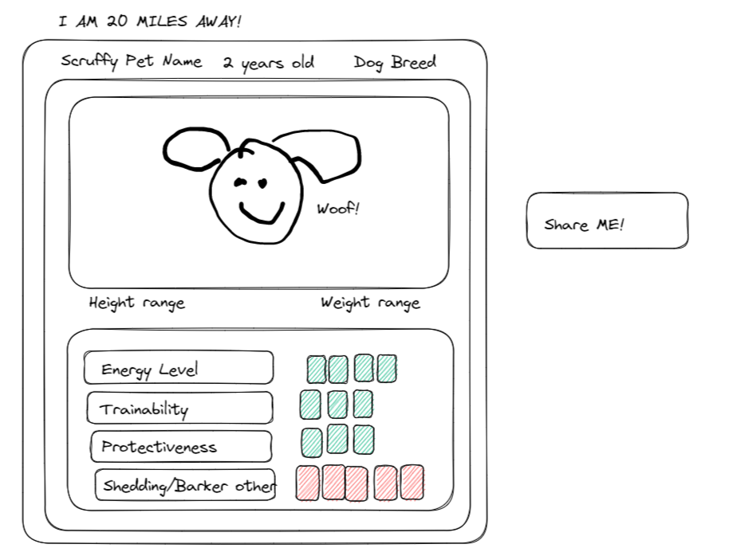

# awesome-scorpions-proj01

 # As a dog lover
 # Given a website created to adopt dogs
 # When I search for a dog by breed 
 # Then I am taken to a results page which contains cards with Dogs images, their name, age, and a photo, as well as specifics about the dogs breed
 # when I click on the dogs image
 # Then I am taken to another page with more detailed information about that specific dog, its current location, and any relevant information regarding adoption
 # When I am on the results page or the Detailed dog info page And click "share me"
 # then That dogs card and energy levels are added to local storage so that when I want to view all the dogs I have shared I see all the dogs I have shared
 

